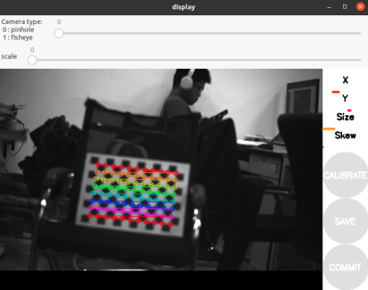

# 环境(ubuntu20.04):

请根据ubuntu版本自行修改

- ros-foxy
```
wget http://fishros.com/install -O fishros && .fishros
```
- camera_calibration
```
sudo apt install ros-foxy-camera-calibration-parsers
sudo apt install ros-foxy-camera-info-manager
sudo apt install ros-foxy-launch-testing-ament-cmake
```

# 编译:
```
colcon build
```

# 设置参数:

- 于`rmos_cam/config/daheng_camera.yaml`中更改图像尺寸，曝光时间等参数


# 运行:
- source
```
source install/setup.bash
```
- 发布图像
    - 使用大恒相机:
        ```
        ros2 run rmos_cam daheng_camera
        ```
    - 使用usb相机:
        ```
        ros2 run rmos_cam usb_camera
        ```
- 标定

`--size` 标定板角点个数（格子数-1）

`--square` 标定板每个格子的长度（单位：m)

`image:=` 图像消息的名称
```
ros2 run camera_calibration cameracalibrator --size 11x8 --square 0.03 --ros-args -r image:=/image_raw -p camera:=/daheng_camera
```


